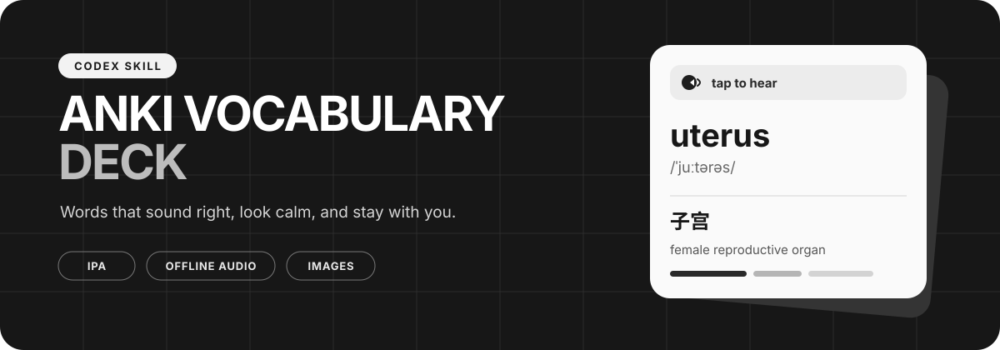

<p align="center">
  
</p>

<p align="center">
  A reusable Codex skill for turning vocabulary lists into calm, consistent, import-ready Anki decks.
</p>

<p align="center">
  
  
  
  
  
</p>

---

## A deck that stays out of the way

This skill keeps the design quiet so the vocabulary remains the focus. It creates cards with a predictable layout, readable type, compact images, and pronunciation that works offline.

<table>
  <tr>
    <th width="50%">Front</th>
    <th width="50%">Back</th>
  </tr>
  <tr>
    <td align="center">
      <br>
      <strong>uterus</strong><br>
      🔊 American pronunciation<br>
      <code>/ˈjuːtərəs/</code>
      <br><br>
    </td>
    <td align="center">
      <br>
      <strong>子宫</strong><br>
      concise study note<br>
      English-labeled image<br>
      source attribution
      <br><br>
    </td>
  </tr>
</table>

## What is included

| Study feature | Default behavior |
| --- | --- |
| Pronunciation | Clickable American-English audio embedded in every card |
| Phonetics | IPA shown directly under the term |
| Explanation | Concise Chinese meaning and a short learning note |
| Visual memory | Embedded English-labeled image with source attribution |
| Appearance | Black, white, and gray; one consistent 20px text size |
| Image sizing | Maximum 400 × 300px, with aspect ratio preserved |
| Compatibility | Designed for both light and dark Anki themes |

## Quick start

```bash
git clone https://github.com/qiq2026qiq/anki-vocab-forge.git ~/.codex/skills/anki-vocab-forge
cd ~/.codex/skills/anki-vocab-forge
python3 -m pip install -r requirements.txt
```

Restart Codex if the skill does not appear immediately.

Then ask Codex:

```text
Use $anki-vocab-forge to turn this vocabulary list into an Anki deck.
```

The skill also activates when you ask Codex to turn a lesson vocabulary list or terminology table into Anki cards in your preferred style.

## Try the included example

From the repository root:

```bash
python3 scripts/build_deck.py examples/spec.example.json --output example.apkg
```

The command creates a one-card deck and runs the package checks automatically. Use [examples/spec.example.json](./examples/spec.example.json) as the starting point for your own deck.

> [!NOTE]
> Automatic pronunciation generation currently uses the macOS `say` and `afconvert` tools. On Windows or Linux, provide a mono WAV file through each card's optional `audio_path` field.

<details>
<summary><strong>Repository structure</strong></summary>

```text
anki-vocab-forge/
├── SKILL.md
├── LICENSE
├── requirements.txt
├── agents/
│   └── openai.yaml
├── assets/
│   └── anki-vocab-banner.svg
├── examples/
│   └── spec.example.json
└── scripts/
    └── build_deck.py
```

</details>

## Design promise

> No bright accent colors, gradients, oversized images, decorative panels, or mismatched font sizes.

See [SKILL.md](./SKILL.md) for the complete workflow and JSON field contract. Released under the [MIT License](./LICENSE).
